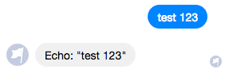

Quick Start
===========

You can follow along with this example at https://github.com/stripethree/enterprise-fbm

Prerequisites
-------------

You should have a test page, test app, webhook, and these environment
variables:

* ``FACEBOOK_APP_ID``
* ``FACEBOOK_PAGE_ID``
* ``MESSENGER_APP_SECRET``
* ``MESSENGER_PAGE_ACCESS_TOKEN``
* ``MESSENGER_VALIDATION_TOKEN``
* ``SERVER_URL``

You can find a walkthrough that gives you this information at:
https://developers.facebook.com/docs/messenger-platform/getting-started/quick-start

These instructions are written for a Node 6+ and npm 5+ development environment.

create ``config/custom-environment-variables.json`` with these contents::

  {
    "launch-vehicle-fbm": {
      "facebook": {
        "appId": "FACEBOOK_APP_ID",
        "pageId": "FACEBOOK_PAGE_ID"
      },
      "messenger": {
        "appSecret": "MESSENGER_APP_SECRET",
        "pageAccessToken": "MESSENGER_PAGE_ACCESS_TOKEN",
        "validationToken": "MESSENGER_VALIDATION_TOKEN"
      },
      "port": "NODE_PORT",
      "serverUrl": "SERVER_URL"
    }
  }

and ``config/default.json`` with these contents::

  {
    "launch-vehicle-fbm": {
      "port": 3000
    }
  }

For your webhook, you'll probably need someting like `Localtunnel
<https://localtunnel.github.io/www/>`_ or `Ngork <https://ngrok.com/>`_.

With that, you can set up your webhook url and the environment variable: ``SERVER_URL``

Hello world
-----------

Let's make a basic echo bot.

In a clean subdirectory::

  npm init --force
  npm install launch-vehicle-fbm

Now create ``index.js``::

  const { Messenger, Text } = require('launch-vehicle-fbm')
  const messenger = new Messenger()

  messenger.start()

  messenger.on('message.text', ({reply, text}) => {
    reply(new Text(`Echo: "${text}"`))
  })

Run the bot::

  DEBUG=messenger* node index.js

Now you can message your page like:

For more advanced usage, continue reading https://github.com/stripethree/enterprise-fbm
and the `wiki <https://github.com/CondeNast/launch-vehicle-fbm/wiki>`_.
